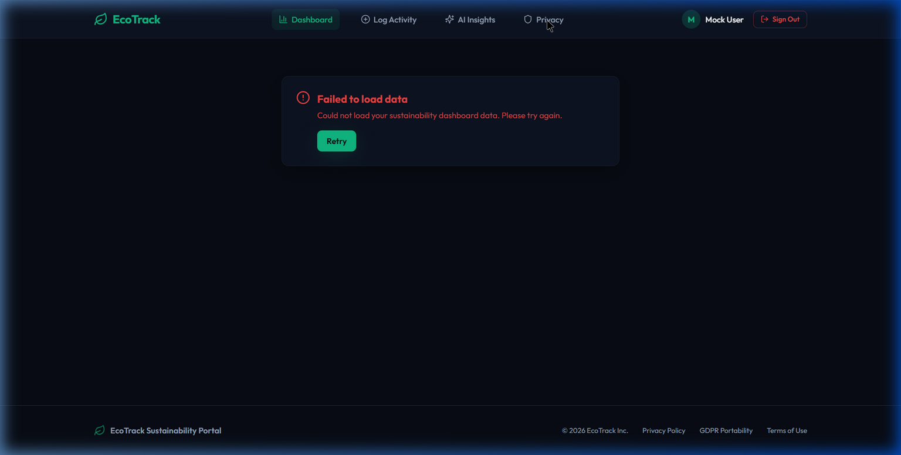
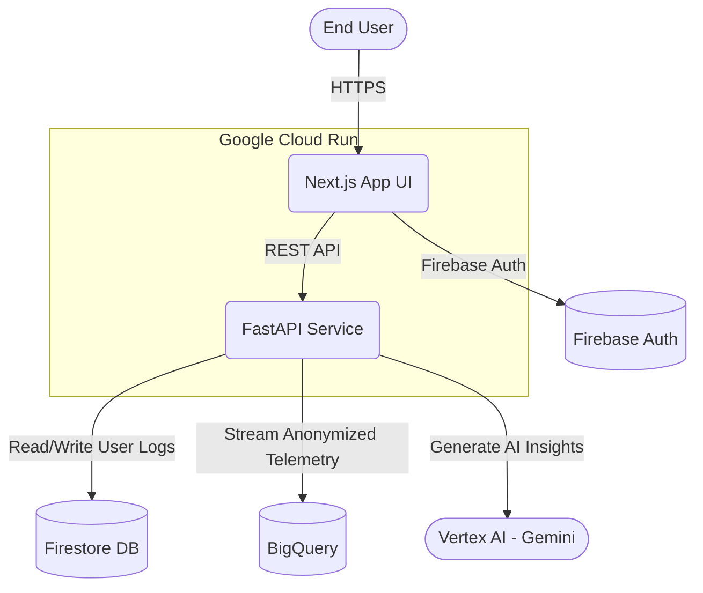

# EcoTrack

[](https://github.com/Abb2907/Ecotrack/actions)
[](https://codecov.io/gh/Abb2907/Ecotrack)
[](https://opensource.org/licenses/MIT)
[](https://github.com/psf/black)
[](https://github.com/astral-sh/ruff)
[](https://www.typescriptlang.org/)



EcoTrack is a production-grade web application to help individuals understand, track, and reduce their carbon footprint.

🚀 **Live App:** [https://ecotrack-frontend-361013050235.us-central1.run.app/](https://ecotrack-frontend-361013050235.us-central1.run.app/)

## Tech Stack
- **Frontend**: Next.js (React) + TypeScript + Tailwind CSS
- **Backend**: FastAPI (Python)
- **Database**: Firestore (GCP Native Mode)
- **Data Analytics**: BigQuery (Aggregated Anonymized Telemetry)
- **AI**: Vertex AI (Gemini 2.0 Flash) for weekly personalized sustainability recommendation generation
- **Auth**: Firebase Authentication (Google Sign-In, Email/Password)
- **CI/CD**: Cloud Build (Automated Dockerization & Deployment)
- **Hosting**: Google Cloud Run (Fully managed serverless container runtime)
- **Code Quality & Testing**: Jest, RTL, Pytest, Ruff, ESLint, Prettier

## Project Architecture
The project follows a modern microservices architecture, heavily utilizing Google Cloud Platform (GCP):



## Core Workflow & Features
1. **Authentication**: Users sign in securely using Firebase Authentication.
2. **Dashboard Overview**: Displays total logged actions, aggregated impact (High/Medium/Low), and recent history pulled securely from Firestore.
3. **Action Logging**: Users browse a catalog of eco-friendly actions (e.g., Recycling, Energy Savings, Transport) and log them. These logs are stored directly against the user's secure profile.
4. **AI-Powered Insights**: 
   - A dedicated Python backend running on FastAPI retrieves the user's 7-day activity log from Firestore.
   - It submits a structured prompt to **Vertex AI (Gemini 2.0 Flash)**.
   - The AI generates contextual, non-repetitive sustainability recommendations (categorized by difficulty and impact).
   - Insights are saved to Firestore and returned to the Next.js frontend.
5. **Interactive AI Log Routing**: Clicking "Log this action" from an AI insight automatically routes the user to the log catalog and uses a fuzzy-search algorithm to pre-select the exact recommended action for immediate logging.

## Getting Started

### Prerequisites
- Node.js (v18+)
- Python (v3.11+)
- GCP CLI (`gcloud`)
- Firebase CLI (`firebase`)

### Setup and Running Locally

1. **Frontend Setup**:
   ```bash
   cd frontend
   npm install
   npm run dev
   ```
2. **Backend Setup**:
   ```bash
   cd backend
   python -m venv venv
   source venv/bin/activate  # On Windows: .\venv\Scripts\activate
   pip install -r requirements.txt
   uvicorn app.main:app --reload
   ```

## Production Deployment
The application uses **Cloud Build** triggered natively from the repository or via manual submission to deploy Docker containers directly to **Google Cloud Run**.

```bash
gcloud builds submit --config cloudbuild.yaml
```
Refer to `infrastructure/gcp_provision.sh` for initial Google Cloud Platform resources provisioning.

## Testing & Code Quality
EcoTrack maintains high code quality and test coverage through robust tooling:

- **Frontend Testing**: Uses Jest and React Testing Library (RTL). Execute tests locally via `npm run test` in the `frontend/` directory.
- **Backend Testing**: Uses Pytest with XML coverage reporting (`pytest --cov-report=xml`).
- **Coverage**: Handled dynamically by [Codecov](https://codecov.io). The CI pipeline uploads test coverage reports on every push, ensuring the coverage badge at the top of this README stays perfectly in sync with the repository.
- **Linting & Formatting**: 
  - **Frontend**: Enforced using ESLint (with `next/core-web-vitals` and `jsx-a11y` accessibility plugins) and Prettier.
  - **Backend**: Managed via Ruff (configured in `pyproject.toml` for strict modern standards) and MyPy.

## Accessibility (WCAG)
EcoTrack is designed to be accessible to all users:
- Semantic HTML tags and ARIA labels are meticulously implemented across UI components.
- Integrated `eslint-plugin-jsx-a11y` guarantees continuous testing against key Web Content Accessibility Guidelines (WCAG) standards during CI pipelines.
- Images rely on optimized `next/image` with strictly enforced `alt` descriptors.
